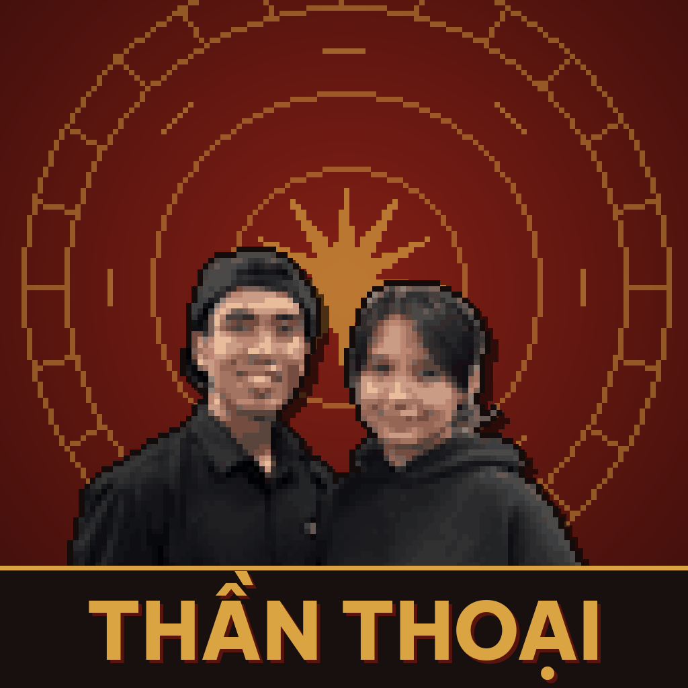
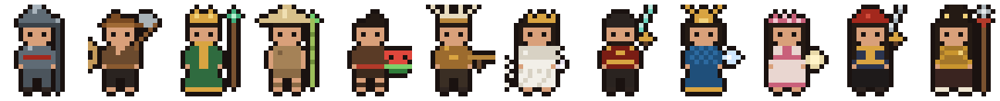

# Thần Thoại



Game idle RPG lấy cảm hứng từ thần thoại, cổ tích Việt Nam. Đội 4 anh hùng truyền thuyết tự đánh quái, đi qua 300 chương để tìm lại báu vật bị đánh cắp. Bản cuối cùng chạy trên Dynamic Island của iPhone; bản web dùng để chơi thử và cân bằng game.



## Chơi thử

Bản web nằm trong một file duy nhất: `index.html`. Mở bằng trình duyệt là chơi được, tiến trình lưu trong trình duyệt.

Bật GitHub Pages để chơi bằng link:
1. Vào **Settings → Pages** của repo.
2. Ở **Build and deployment**, chọn **Deploy from a branch**, nhánh `main`, thư mục `/ (root)`.
3. Sau khoảng một phút, game chạy ở `https://<tên-tài-khoản>.github.io/<tên-repo>/`.

Trên iPhone: mở link bằng Safari → Chia sẻ → Thêm vào MH chính. Biểu tượng và tên **Thần Thoại** hiện trên màn hình chính.

## Nội dung game

- **12 anh hùng**: Thánh Gióng, Thạch Sanh, Sơn Tinh, Chử Đồng Tử, Mai An Tiêm, Cao Lỗ, Mỵ Châu, Lê Lợi, Lạc Long Quân, Âu Cơ, Hai Bà Trưng, Bà Triệu. Đội tối đa 4, cấp tối đa 500.
- **3 độ khó, 300 chương, 3.000 màn**: Nhân Gian, Âm Phủ, Thiên Giới. Mỗi chương 10 màn (1-1 … 1-10), con cuối mỗi màn là quái tinh anh, màn 10 là boss chương, chương 10/20/30… là boss hồi.
- **Trang bị 12 ô** mỗi hero, 5 độ hiếm (sắt, đồng, bạc, vàng, thần), độ hiếm càng cao càng nhiều dòng chỉ số.
- **Lò rèn**: cường hóa +1 đến +15, ép 3 món thành 1 món hiếm hơn.
- **4 loại rương**, **6 thú cưỡi**, **6 thú cưng**, cửa hàng hiệu ứng và nâng cấp vĩnh viễn, lực chiến và bảng xếp hạng.
- Cốt truyện có twist: Hắc Y, Kim Quy, cô bán trà và Cửu Vĩ Hồ Tinh.

Chi tiết thiết kế: [docs/thiet-ke.md](docs/thiet-ke.md).

## Bảng xếp hạng Google Sheets

1. Mở bảng tính xếp hạng → **Tiện ích mở rộng → Apps Script**.
2. Xoá mã có sẵn, dán nội dung `apps-script/BangXepHang.gs`, bấm Lưu.
3. **Triển khai → Tùy chọn triển khai mới → Ứng dụng web**. Thực thi với tư cách: **Tôi**. Người có quyền truy cập: **Bất kỳ ai**. Bấm Triển khai và cấp quyền.
4. Sao chép link kết thúc bằng `/exec`.
5. Dán link vào hằng số `SHEET_URL` trong `index.html` (bản này đã gắn sẵn link của bảng chung).
6. Người chơi vào **Hành trình → Bảng xếp hạng Google Sheets**, nhập tên, bấm **Gửi lực chiến**. Sau đó game tự gửi lại mỗi 15 phút.

Lưu ý: ai có link cũng gửi được điểm, nên đây chỉ là giải pháp tạm. Bản phát hành nên dùng Game Center.

## Cấu trúc thư mục

```
index.html            Bản web chơi được (HTML, CSS, JS trong một file)
docs/thiet-ke.md      Tài liệu thiết kế: cốt truyện, hệ thống, công thức
assets/icon/          Biểu tượng app (1024 và 180 px)
assets/sprites/       Bảng sprite pixel: hero, quái, boss, thú, trang bị
apps-script/          Mã nhận điểm cho bảng xếp hạng Google Sheets
ios/IslandHero/       Mã Swift cho app iOS (Dynamic Island, Live Activity)
  App/                App chính
  Shared/             Dùng chung app và widget: logic game, GameBalance
  Widget/             Giao diện Dynamic Island và Lock Screen
```

## Bản iOS

Thư mục `ios/` là bản đầu của app Dynamic Island: một hero, thanh máu quái tự chạy theo đồng hồ, nút bấm ngay trên island (iOS 17+). `GameBalance.swift` chứa công thức chỉ số cho 3.000 màn, khớp với bản web. Cách dựng project trong Xcode: [ios/README.md](ios/README.md).

Nội dung của bản web (12 hero, trang bị, lò rèn, thú…) chưa được chuyển sang Swift.

## Lộ trình

- [ ] Chuyển toàn bộ hệ thống từ bản web sang Swift
- [ ] Bảng xếp hạng bằng Game Center
- [ ] Hoạt hình trên island bằng kỹ thuật font tuỳ chỉnh
- [ ] Mua trong ứng dụng

## Bản quyền

Chưa chọn giấy phép. Khi muốn cho người khác dùng lại mã, thêm file `LICENSE` (ví dụ MIT) qua **Add file → Create new file → LICENSE** trên GitHub.
